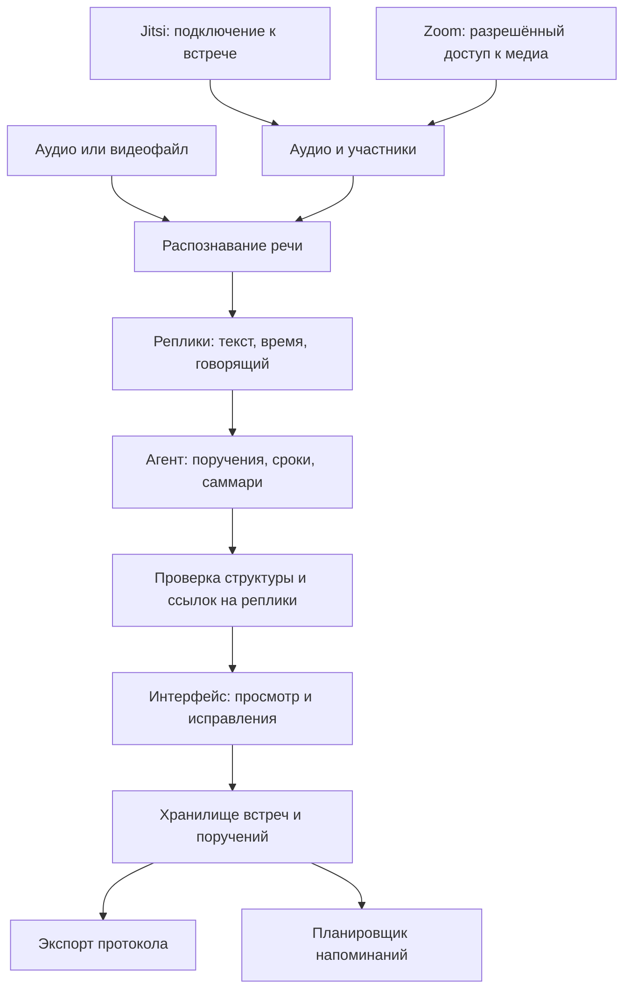

# Как устроить ассистента совещаний

Статус: предложение для обсуждения 23.09.2026. Стек и план не утверждены. HANDOFF используется только как справка о наличии сервера; состояние моделей на нём не проверено.

## Что получит пользователь

Рабочая идея пользователя — отдельное приложение/сервис, которое получает аудио встречи, желательно отдельными дорожками. Небольшой веб-интерфейс — наше предложение: пользователь загружает запись или подключает встречу; видит состояние записи и обработки; после встречи получает транскрипт, таблицу поручений и саммари. Можно проверить спорные поля, перейти к подтверждающей реплике и выгрузить протокол. Для полного сценария нужны хранение поручений и напоминания о сроках.

Система нужна даже при использовании готового агента. Она хранит встречи, результаты, статусы и права доступа. Пользовательский интерфейс может быть маленьким: поле подключения/загрузки и три вкладки результата. Чат с агентом возможен, но не заменяет таблицу задач и проверяемый документ.

## Четыре ответственности, три основные части продукта

Это схема ответственности, не требование разворачивать каждый блок отдельным микросервисом. Приложение и обработчик задач могут быть простыми; GPU-модели работают на своём сервере.

| Часть | Ответственность | Что остаётся разработать |
|---|---|---|
| Подключение к встречам | Присоединение/авторизация, уведомление о записи, получение аудио, участники, переподключение и остановка. | Адаптер для каждой платформы, нормализация аудиособытий. |
| Распознавание | RU/KZ/смешанная речь, текст, время, говорящие. | Сборка и проверка моделей на наших данных; диаризация для смешанной записи. |
| Агент | Разбор смысла, исполнители, согласованные сроки, объединение повторов, саммари. | Инструменты предметной области, инструкции, формат результата и проверки. |
| Система | Интерфейс, состояние обработки, хранение, правки, экспорт, напоминания. | Небольшое приложение вокруг моделей и агента. |

При раздельных дорожках платформа даёт связь аудио с участником. Для общего MP3 нужна отдельная диаризация. Одно устройство может обслуживать нескольких людей, а имя профиля не всегда настоящее: связь с человеком остаётся проверяемой. Исполнитель поручения может вообще не говорить на встрече.

## Где действительно нужен агент

Рекомендуется взять готовый движок цикла «модель → вызов инструмента → результат → следующий шаг». Он позволяет агенту по необходимости перечитать контекст, уточнить исполнителя и проверить срок.

Предлагаемые инструменты:

- `get_segment` — получить исходную реплику и соседние реплики.
- `get_participants` — получить известные имена и связи с дорожками.
- `normalize_deadline` — разобрать исходный срок относительно заданной даты встречи; неоднозначность сохранить.
- `validate_assignments` — проверить поля и ссылки на источники, показать противоречия.

Результат агента — структурированный объект протокола. Сериализация DOCX/PDF, сохранение и срабатывание таймера выполняются обычным кодом по проверенным данным. Это делает повторный экспорт и напоминания предсказуемыми.

Пример: на вопрос «двух недель хватит?» следует ответ «лучше три», затем решение «к 15 октября». Агент собирает одно поручение с окончательным сроком и ссылками на реплики. Проверки не позволяют превратить обсуждение в три независимые задачи.

Выполнять поручения участников за них — другая функциональность. Слова «Ерлан подготовит претензию» создают запись о поручении; они не дают агенту разрешения самостоятельно отправить претензию. Если нужен агент, который ещё говорит на встрече, потребуются синтез речи, отправка аудио и правила вступления в разговор. Пользователь уточняет этот режим отдельно.

## Готовый движок: Hermes или библиотека

Варианты и первичные источники собраны в [agent-options.md](agent-options.md). Готовый runtime экономит разработку вызовов инструментов, но не содержит нашего способа извлечения поручений, закрытого ASR, подключения ко всем встречам и интерфейса проверки протокола.

Предварительная рекомендация для встроенного агента — PydanticAI; Hermes имеет смысл, если нужен более широкий ассистент с постоянной памятью, навыками и каналами общения. Окончательный выбор должен следовать за небольшим одинаковым тестом на наших репликах и локальной LLM, если пользователь согласует такой шаг. Названия выбранных ранее компонентов в HANDOFF не считаются решением.

## Jitsi: два пути

1. Видимый участник-бот через `lib-jitsi-meet`: подключение к комнате и получение удалённых дорожек. Это соответствует ожиданию «ассистент заходит во встречу». Библиотека предоставляет подключение и события дорожек; запись, серверный запуск клиента и обработку состояния нужно собрать и проверить. [Официальный API](https://jitsi.github.io/handbook/docs/dev-guide/dev-guide-ljm-api/).
2. На собственном Jitsi — серверная передача аудио в транскрибацию без отдельного участника. Текущая инструкция описывает JVB → WebSocket proxy, раздельное аудио участников и self-hosted backend через совместимый realtime-протокол. Обычного файлового ASR endpoint может быть недостаточно: нужен совместимый адаптер. Jigasi-транскрибация в этом руководстве объявлена устаревающим путём. [Руководство Jitsi](https://jitsi.github.io/handbook/docs/devops-guide/transcription/).

Предложение: если нужен именно видимый бот, исследовать первый путь; если важнее закрытая собственная конференция с протоколом, рассмотреть второй. Не обещать доступ к произвольному чужому Jitsi: настройки комнаты, аутентификация и разрешения могут отличаться.

## Zoom: доступ к медиа — отдельная зависимость

Текущая страница Linux Meeting SDK направляет AI-протоколистов на RTMS; использовать старые примеры SDK-ботов как доказательство допустимого сегодняшнего пути нельзя. [Zoom Meeting SDK](https://developers.zoom.us/docs/meeting-sdk/linux/).

RTMS предоставляет потоки аудио участников с идентификаторами, именами и временем; транскрипт Zoom нам не нужен, распознавание предполагается своё. [RTMS media](https://developers.zoom.us/docs/rtms/meetings/media/).

Для RTMS документация требует приложение, соответствующие scopes и активный Developer Pack с кредитами. Включение потока зависит от настроек и разрешений встречи. Это не универсальный бот, которому достаточно любой ссылки. [Начало работы](https://developers.zoom.us/docs/rtms/meetings/getting-started/), [управление потоками](https://developers.zoom.us/docs/rtms/meetings/work-with-streams/).

Есть готовые проекты транспортного слоя, например self-hosted Attendee. Его README описывает внешнюю транскрибацию Deepgram в стандартном сценарии — её нельзя принять в нашем кейсе. Даже переиспользование только захвата требует проверки локального выхода аудио, платформенных разрешений и совместимости с текущими правилами Zoom. Поэтому Attendee пока кандидат для исследования, а не утверждённая зависимость. [Репозиторий Attendee](https://github.com/attendee-labs/attendee).

Рекомендуется сохранить Zoom в требованиях и проверить доступность допустимого интеграционного пути до обещания работающего подключения. Независимую проверку ядра обеспечить на файлах и собственном Jitsi; это не объявляется заменой Zoom.

Zoom сам является внешней платформой связи. Полностью закрытый режим доказывается отдельно на файле/собственном Jitsi. Запрет отправки контента внешнему ASR/LLM остаётся для всех режимов; трактовку подключения к внешним конференциям следует согласовать с организатором при необходимости.

## Что предлагается сделать следующим

Сначала изучить существующую gRPC-реализацию раздельных дорожек пользователя (ссылка ожидается). Проверить источник аудио, идентификаторы участников, формат/время пакетов, обработку переподключений и то, какие платформы уже поддержаны. Наличие gRPC само по себе не подтверждает интеграцию с Zoom/Teams/Meet или идентификацию конкретного человека.

Teams, Zoom и Google Meet названы исходным ТЗ; Jitsi обсуждается как возможная реализация. Предыдущее обозначение Jitsi/Zoom как нового требования пользователя исправлено. Видимый участник-бот не выбран: отдельный сервис может получать медиа через разрешённый интерфейс без такого участника, если платформа это поддерживает.

После просмотра существующей реализации согласовать короткую техническую проверку трёх рисков:

- запись → локальный транскрипт на имеющейся машине;
- транскрипт → агент с вызовом инструмента → проверяемый объект поручений;
- живая встреча Jitsi → аудио с идентификатором участника; параллельно установить доступность Zoom RTMS.

Это порядок проверки гипотез, не новый принятый план этапов. Реализация и установка зависимостей в рамках исследования не выполнялись. Наличие сервера не подтверждает, что выбранные модели уже запущены.
