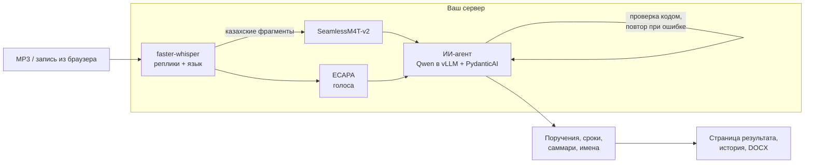

# Хаттама — ИИ-секретарь совещаний, который работает целиком на вашем сервере

**Совещание закончилось — через минуту готов протокол: кто что поручил, кому и к какому сроку, со ссылкой на каждую фразу-доказательство. Русский, казахский и смешанная речь. Ни одного вызова внешнего API: запись и текст не покидают ваш контур.**

Кейс HackAlem, трек 8 «Инновации». «Хаттама» по-казахски — «протокол».

## Зачем

После каждого совещания секретарь час переслушивает запись, чтобы выписать поручения. Часть задач теряется, сроки размываются в «на следующей неделе», а через месяц уже никто не помнит, кто что обещал. В Казахстане к этому добавляются две проблемы, которые не решают массовые сервисы:

- **язык**: совещания идут на русском, казахском и вперемешку («шала-казахский»);
- **данные**: запись совещания холдинга, госоргана или банка нельзя отправлять в облачный сервис — ни в зарубежный, ни в какой-либо ещё.

## Для кого

Секретариаты и аппараты руководителей холдингов, квазигосударственных компаний, банков и госорганов — везде, где исполнительская дисциплина важна, а данные не должны выходить за периметр.

## Что Хаттама делает уже сейчас

- **Распознаёт русский, казахский и смешанную речь.** Whisper определяет язык каждого фрагмента; казахские фрагменты перераспознаёт специализированная модель SeamlessM4T — ошибка на казахской записи падает примерно с 45% до **11%**.
- **Понимает, кто говорит.** Голоса разделяются по тембру, и каждый голос получает имя из того, как люди обращаются друг к другу. Имена не выдумываются: без явного признака голос остаётся без имени.
- **Извлекает поручения: кто, что, к какому сроку.** ИИ-агент на self-hosted LLM читает стенограмму, может перечитать нужные реплики и выдаёт поручения по строгой схеме. Код проверяет каждый ответ агента: несуществующая реплика, человек не из списка участников или одно имя на два голоса — и агент исправляет ответ.
- **Доказывает каждое поручение.** У каждого поручения ссылка «→ #N» на реплику, из которой оно взято: секретарь проверяет протокол за минуты, а не верит ИИ на слово.
- **Превращает «до пятницы» в дату и следит за сроком.** Статусы «в работе», «скоро срок», «просрочено».
- **Записывает встречу прямо из браузера**: микрофон и звук вкладки Teams, Zoom или Meet, с обязательным подтверждением, что участники предупреждены о записи.
- **Выдаёт готовый DOCX** с поручениями, саммари и стенограммой; все протоколы хранятся в истории. [Пример протокола](docs/examples/meeting-2.docx).

## Полностью на вашем контуре

- Все модели — распознавание, разделение голосов, языковая модель — работают в ваших контейнерах на одном GPU-сервере. **Аудио и текст не отправляются ни в один внешний API.**
- Сервис проверяет это в коде: адрес языковой модели вне частной сети отклоняется.
- Аудио не хранится: запись удаляется сразу после обработки. Голосовые отпечатки не сохраняются.
- Интерфейс без внешних CDN и телеметрии. Все версии моделей и образов закреплены.
- Разворачивается несколькими командами `docker compose`; от чистого сервера до первого протокола — около 20 минут ([журнал](docs/runs/1645-fresh-machine-cold-readme.log)).

## Почему этому можно верить

Каждая цифра ниже получена реальным прогоном моделей и подкреплена журналом в [docs/runs](docs/runs/); результаты сохранены в репозитории, и цифры пересчитываются без GPU.

| Проверка | Результат |
|---|---|
| Совещания №1 и №2 из комплекта организаторов против эталонных протоколов | найдены **10 из 10 и 6 из 6** поручений эталона с тем же ответственным и сроком, лишних нет ([журнал](docs/runs/1708-reference-match.log)) |
| Казахская запись | ошибка распознавания **11%**, поручения **3 из 3** |
| Смешанная русско-казахская речь | поручения **3 из 4**, лишних нет; ошибка распознавания 36% — главное направление доработки |
| Кто говорит | 5 голосов на каждом совещании, по именам названы 4 из 5 и **5 из 5** |
| Скорость | совещание 3,5–4,5 минуты обрабатывается за 30–65 секунд |
| Чистый сервер строго по README | установка и полная проверка с реальными моделями — **PASS** ([холодный старт](docs/runs/1645-fresh-machine-cold-readme.log), [check.sh all](docs/runs/1713-eldest-check-all.log)) |

## Как устроено



## Проверить за 5 минут без GPU

Три команды раздела 1 и `bash scripts/check.sh replay` → `PASS replay`. Метрики пересчитываются из сохранённых реальных результатов:

```bash
uv run --locked python scripts/evaluate.py data/eval/kz_01.json data/eval/mix_01.json
uv run --locked python scripts/compare_reference.py
```

## Соответствие кейсу

| Требование кейса | Что сделано | Статус |
|---|---|---|
| Распознавание RU, KZ, смешанной речи | faster-whisper large-v3; казахские фрагменты — SeamlessM4T-v2 | есть; смешанная речь — точность растёт в дорожной карте |
| Кто говорит | ECAPA + имя по обращениям в речи | есть |
| Поручения: кто, что, срок | ИИ-агент на self-hosted Qwen, ссылки на реплики, даты сроков | есть |
| Саммари и протокол | страница результата, история, DOCX | есть |
| Уведомление о записи | подтверждение секретаря перед записью | есть |
| Контроль сроков | статусы «скоро срок / просрочено» | есть; автоматические напоминания — агентный слой в дорожной карте |
| Источник звука | файл и запись микрофона + вкладки Teams/Zoom/Meet из браузера | есть; бот-участник — в дорожной карте |
| Закрытый контур | всё в своих контейнерах, без внешних API | есть |

Полный запуск, детали и честные ограничения — ниже. Дорожная карта — в конце: [от протокола к корпоративному ИИ-агенту](#дорожная-карта-от-протокола-к-корпоративному-ии-агенту).

## 1. Запуск без GPU и Docker: воспроизведение

**Это воспроизведение заранее вычисленных результатов, не проверка моделей.** Новая запись в этом режиме не распознаётся. Поддерживаются только два MP3 из комплекта организаторов; переименование файла допустимо, изменение содержимого — нет.

Нужны Git, интернет для первоначальной установки зависимостей и **uv 0.12.18** ([установка uv](https://docs.astral.sh/uv/getting-started/installation/)). Python **3.11.13** устанавливается uv автоматически; все зависимости закреплены в `uv.lock`. Личные аккаунты и платные подписки не нужны.

Из корня клонированного репозитория (bash, zsh или PowerShell; в Windows cmd.exe не проверялось):

```bash
uv sync --locked
uv run --locked python -m meeting_protocol "docs/Трек 8 Инновации/Совещание №1.mp3" --output outputs/meeting-1
uv run --locked python -m meeting_protocol "docs/Трек 8 Инновации/Совещание №2.mp3" --output outputs/meeting-2
```

В `outputs/` появятся JSON и DOCX для каждой записи. В документе есть исходный транскрипт, таблица поручений, саммари, сведения о происхождении и пометка о воспроизведении. Дата демонстрационных встреч принята за **23.09.2026**, это заданная база примера, не установленная из аудио дата.

Минимальный веб-интерфейс:

```bash
uv run --locked python -m uvicorn meeting_protocol.web:app --host 127.0.0.1 --port 8001
```

Откройте [http://127.0.0.1:8001](http://127.0.0.1:8001), загрузите один из комплектных MP3 и оставьте дату 23.09.2026. Откроется страница результата с кнопкой «Скачать DOCX»; протокол также появится на странице «История». Для неизвестного аудио отображается ошибка, вместо него не подставляется пример.

На форме есть **«Участники»** (по одному имени на строку) и **«Тема»**. Для двух MP3 поля заполняются по SHA-256 записи из `data/meeting-context.json`: только имена и темы из эталонных протоколов, без готовых поручений и сроков. В CLI эти же данные подставляются по хешу, если параметры не заданы. В списке второго примера также указан упомянутый юрист Ерлан; фамилий, которых нет в источнике, мы не добавляем. В режиме воспроизведения изменение темы, участников или даты отклоняется: для перерасчёта нужен GPU.

Проверка из свежего клона, включая оба документа и тесты:

```bash
bash scripts/check.sh replay
```

`check.sh` требует bash (в Windows — Git Bash). Ожидаемый итог: `PASS replay: не проверка моделей`; два теста диаризации в этом режиме пропускаются (`skipped`), потому что GPU-зависимости не установлены.

## 2. Полный запуск моделей: Docker Compose и GPU

Проверенная машина, объём скачивания и время обработки: [docs/ENVIRONMENT.md](docs/ENVIRONMENT.md). Нужны Linux x86_64, Docker Engine с Compose v2 и NVIDIA Container Toolkit. Для проверяемой конфигурации используется NVIDIA RTX PRO 6000 Blackwell Server **96 ГБ VRAM**, драйвер 595.91.07, примерно 64 ГБ RAM. Минимальные ресурсы для других GPU не измерены. Предусмотрите около 100 ГБ свободного диска на образы, модели и кэши; точный минимум не измерен. Первое скачивание моделей требует интернета, но не аккаунтов; аудио/текст при скачивании не передаются.

В конфигурации фиксированы CUDA-библиотеки для ASR, torch 2.8.0+cu128, точные ревизии моделей и digest образа vLLM. GPU-конвейер не откатывается на воспроизведение при ошибке.

Из корня репозитория:

```bash
mkdir -p outputs
docker compose build app
docker compose up -d --wait --wait-timeout 1800 llm
docker compose run --rm app -m meeting_protocol "docs/Трек 8 Инновации/Совещание №1.mp3" --mode gpu --date 2026-09-23 --output outputs/meeting-1
docker compose run --rm app -m meeting_protocol "docs/Трек 8 Инновации/Совещание №2.mp3" --mode gpu --date 2026-09-23 --output outputs/meeting-2
```

Та же страница с реальными моделями:

```bash
docker compose up -d app
```

Адрес — [http://127.0.0.1:8001](http://127.0.0.1:8001). Сервис LLM доступен только во внутренней сети Compose. Приложение привязано к localhost; для удалённой машины используйте SSH-туннель. Публичный сервис с авторизацией не реализован.

Остановка:

```bash
docker compose down
```

Проверка GPU из свежего клона выполняет приведённые выше команды, проверяет DOCX/JSON и завершает созданные проверкой контейнеры:

```bash
bash scripts/check.sh gpu
```

Оба режима за один запуск (нужны uv и свободная GPU):

```bash
bash scripts/check.sh all
```

Существующие модели на GPU занимают память: остановите свой предыдущий запуск Compose до полной GPU-проверки. Проверка использует отдельное имя проекта, исходные файлы клонирует во временный каталог; кэши моделей остаются в исходном репозитории `.cache/`. `.env.example` документирует настройки; для своих кэшей задайте `LLM_CACHE_DIR` и `ASR_CACHE_DIR`. Секреты и кэши исключены из git.

Для новой записи передайте свои данные (пустая строка явно отключает соответствующую подсказку):

```bash
docker compose run --rm app -m meeting_protocol "docs/Трек 8 Инновации/Совещание №2.mp3" --mode gpu --date 2026-09-23 --topic "Доклады по производственным показателям направлений" --participants "Данияр Серикович; Ботагоз Нурлановна; Жандос Талгатович; Ерболат Мухтарович; Салтанат Ерболовна; Ерлан" --output outputs/meeting-2
```

Тема и список имён поступают **только в LLM-агента**, не в Whisper. Для ответственных людей агент выбирает точное написание из списка; несовпадение возвращается агенту на исправление. Если сопоставление неясно — ответственный не указан. Подразделения остаются допустимыми исполнителями. Наличие человека в списке само по себе не означает, что ему поручена задача. Список и тема сохраняются в JSON и DOCX; исходные реплики ASR не переписываются.

Постоянный dev-стек, которым пользовалась команда на Brev, описан в [docs/ENVIRONMENT.md](docs/ENVIRONMENT.md).

## Казахский и смешанный язык (M3, M4) и измеренное качество

Whisper распознаёт всю запись; реплики группируются в окна до 20 с, язык окна определяет Whisper. Окна с казахским (`kk`) перераспознаются SeamlessM4T-v2-large (`tgt_lang="kaz"`), остальные остаются за Whisper. Seamless не применяется к русской и смешанной речи: в предварительном замере с `kaz` он пересказывал смешанную запись по-казахски и терял текст (WER около 100%, предварительный замер, журнал не сохранён), с `rus` — переводил казахские куски на русский. Язык окна показан в JSON (`language`) и меткой KZ на странице.

Реальный прогон на Brev ([журнал](docs/runs/)). Его результаты сохранены в `data/eval/` (хеши совпадают с `data/test/*.m4a`), поэтому таблицу можно проверить без GPU:

```bash
uv run --locked python scripts/evaluate.py data/eval/kz_01.json data/eval/mix_01.json
```

После собственного GPU-прогона вместо `data/eval/` укажите свои JSON из `outputs/`.

| Запись | Язык окон | WER | Поручения: найдено из эталона | Верных из выданных |
|---|---|---:|---:|---:|
| `kz_01` — казахский | kk | 11,1% (только Whisper — около 45% в предварительном замере, без журнала) | 3/3 | 3/3 |
| `mix_01` — шала-казахский | ru | 36,3% | 3/4 | 3/3 |
| Совещание №1 (RU) | ru | — | 10/10 строк эталона: ответственный и срок совпадают; в одной ASR исказил название объекта, в одной задача сформулирована иначе | 10/10 |
| Совещание №2 (RU) | ru | — | 6/6 строк эталона; две разбиты на два поручения, итого 8; уточнение срока в реплике №60 не учтено | 8/8 |

Ограничения замера: эталон `data/test` — сценарий, по которому читали, на слух не сверен; записи короткие (55–70 с) и начитаны одним человеком. В `mix_01` пропущено условное поручение («если релиз сдвинется — сообщить клиенту»); казахские вставки внутри русской речи Whisper передаёт звучанием, а не словами — основная причина WER 36%. Диаризация на `mix_01` ошибочно делит один голос на несколько меток. Совещания №1/№2 сверены вручную по выводу `scripts/compare_reference.py`: таблицы эталонных DOCX организаторов рядом с нашими поручениями ([журнал](docs/runs/1708-reference-match.log)).

## Запись встречи в браузере (R5, R3)

Вкладка «Записать встречу»: секретарь подтверждает, что объявил участникам о записи и ИИ-транскрибации (без отметки запись не начинается), затем браузер пишет микрофон и, по выбору, звук вкладки Meet/Teams/Zoom или экрана (`getDisplayMedia`); потоки смешиваются Web Audio API в один WEBM и идут в тот же конвейер. Если при выборе вкладки не отмечено «Поделиться звуком», страница прямо предупреждает, что голоса собеседников не записываются. Звук вкладки отдают Chrome и Edge; Safari и Firefox — только микрофон. Для записи нужен режим GPU. Без наушников микрофон может повторно записать собеседников из динамиков. Запись из браузера проверялась вручную на Brev; журнала в `docs/runs` нет, в `check.sh` она не входит.

## Хранение протоколов

Каждый обработанный протокол сохраняется на сервере как JSON в `outputs/protocols/` (каталог задаётся `PROTOCOL_DIR`; в Compose он на томе `./outputs`). Страница «История» показывает все встречи с числом поручений и сроков; любой протокол можно открыть снова, скачать DOCX или удалить без восстановления. **Аудио не хранится**: загруженный файл лежит во временном каталоге только на время обработки. Разграничения доступа нет: сервис рассчитан на закрытый контур и слушает localhost; вход по пользователям и роли не реализованы.

## Различение говорящих (M6)

1. Whisper делит запись на реплики. Для каждой реплики [SpeechBrain ECAPA](https://huggingface.co/speechbrain/spkrec-ecapa-voxceleb) строит голосовой отпечаток (эмбеддинг 192 числа); реплики короче 1 с расширяются до 1 с.
2. Реплики длиннее 1 с группируются агломеративной кластеризацией по косинусному расстоянию (порог 0,5). Если указан список участников, голосов не может быть больше, чем людей в списке. Группы, в которых меньше 6 с речи, считаются отколовшейся частью другого голоса и присоединяются к ближайшему; короткие реплики тоже присоединяются к ближайшему голосу. Группы получают метки `SPEAKER_1..N` в порядке первого появления.
3. Агент получает транскрипт с метками и называет метку именем из списка участников **только по явному признаку**: обращение по имени и ответ этим голосом, представление, передача слова. Номера подтверждающих реплик сохраняются. Одно имя не может получить две метки; без признака метка остаётся без имени.
4. Исполнитель поручения определяется по смыслу, а не по тому, кто говорил.

Порог 0,5 подобран на двух комплектных MP3: при нём на обоих совещаниях получается 5 голосов, как в эталонных протоколах; при 0,6–0,7 голоса начинают сливаться (ручные прогоны, журнал не сохранён). Результат реального прогона: на совещании №1 названы 4 из 5 голосов (к ведущему в записи не обращаются по имени), на №2 все 5. На записи из браузера (микрофон + вкладка) до ограничения по списку один человек распадался на несколько голосов; на `mix_01` (один голос) ограничение уменьшило ложные голоса с 5 до 2 (итог 2 голоса — в [журнале](docs/runs/1627-diarization-cap-gpu.log), значение 5 до ограничения — ручной прогон без журнала). Ошибки: если в одной реплике Whisper звучат два человека, она целиком приписывается одному голосу. Точность разметки (DER) не измерялась — ручной посекундной разметки нет.

## Архитектура и проверка моделей

- `meeting_protocol/pipeline.py`: faster-whisper large-v3 на CUDA и PydanticAI с self-hosted Qwen/vLLM. Агент может перечитать реплику и её соседей, выдаёт проверяемую схему поручений; ссылки на отсутствующие реплики отклоняются. Структурная проверка не гарантирует смысловую точность.
- `meeting_protocol/ui/`: страница загрузки и записи (HTML, CSS, JS без внешних CDN — работает в закрытом контуре).
- `scripts/evaluate.py`: WER и совпадение поручений с эталоном `data/test/*.reference.md`.
- `meeting_protocol/diarization.py`: ECAPA-эмбеддинги реплик и кластеризация, метки `SPEAKER_N`.
- `meeting_protocol/protocol.py`: типы протокола, поиск сохранённого результата по хешу, экспорт DOCX. Не импортирует модели и не обращается к LLM.
- `meeting_protocol/__main__.py` и `web.py`: CLI и FastAPI поверх общего конвейера. Один веб-запрос обрабатывает одну запись; одновременный второй запрос отклоняется.
- `scripts/check.sh`: свежий клон текущего коммита, точные команды выбранного режима, проверка происхождения результатов и содержимого документов. `all` не пропускает GPU-проверку при отсутствии GPU.

Ранние проверки совместимости на первых 20 секундах `data/test/kz_01.m4a`:

```bash
docker compose run --rm app scripts/smoke_models.py whisper data/test/kz_01.m4a
docker compose run --rm app scripts/smoke_models.py seamless data/test/kz_01.m4a
```

faster-whisper/CTranslate2 и SeamlessM4T успешно выдали текст на Blackwell при ранней проверке этапа 1. Это подтверждает совместимость; качество на казахском и смешанном языке измерено отдельно (раздел выше). vLLM первоначально падал из-за `max_num_seqs=1024`; исправленная конфигурация ограничивает параллельность до 8 при той же модели.


## Проверки и журналы — 23.09.2026

- [Холодный старт на новой чистой машине](docs/runs/1645-fresh-machine-cold-readme.log): команды разделов 1 и 2 README строго по порядку, от установки uv до веб-страницы — все шаги успешны, около 20 минут ([замеры](docs/ENVIRONMENT.md)).
- [Полная проверка `check.sh all` финального кода на новой машине](docs/runs/1713-eldest-check-all.log): replay и GPU с собственным vLLM, оба MP3, проверка JSON и DOCX — PASS (коммит d0056de).
- [Полная GPU-проверка свежего клона на Brev](docs/runs/1632-check-gpu-full.log): `check.sh gpu` с собственным vLLM, оба MP3, проверка JSON и DOCX — PASS (коммит 25cd367; после него изменены скрипт снятия конфигурации, кодировка UTF-8 при чтении JSON и управление записью в браузере в `ui/app.js`; конвейер обработки не менялся).
- [Независимая QA-проверка свежего клона без GPU](docs/runs/1645-qa-check-replay.log): `check.sh replay` — PASS, 15 тестов пройдено, 2 пропущено.
- [Полная проверка свежего клона на Brev](docs/runs/1504-stage1-fresh-all-check.log): `check.sh all`, четыре теста, оба MP3 в режимах replay и GPU, проверка JSON и DOCX; оба режима завершились PASS. Журнал содержит хеш проверенного коммита. Последующая правка check.sh только создаёт каталог outputs до Docker для самостоятельного GPU-режима; код обработки не изменён.
- [Свежий клон без GPU на Mac](docs/runs/1504-stage1-fresh-replay-check.log): `check.sh replay` — PASS. После решения пользователя дальнейшие рабочие запуски выполняются только на Brev; путь без GPU остаётся в проекте для экспертов.
- [faster-whisper на Blackwell](docs/runs/1453-stage1-whisper-smoke.log) и [SeamlessM4T на казахском фрагменте](docs/runs/1453-stage1-seamless-smoke.log): реальное распознавание успешно.
- [Загрузка через веб-форму](docs/runs/1505-stage1-web-scenario.log): комплектный MP3 возвращает открывающийся DOCX с поручениями и пометкой воспроизведения.

## Данные и сторонние компоненты

- `docs/Трек 8 Инновации/`: ТЗ, два MP3 и два эталонных DOCX из комплекта организаторов. Из эталонов в `data/meeting-context.json` перенесены только тема и имена для открытого контекста агента. Поручения и сроки из эталонов не используются как ответы моделей. Перед публичной демонстрацией реальных персональных данных требуется анонимизация; происхождение имён в комплектных записях отдельно не подтверждено.
- `data/test/kz_01.m4a` и `mix_01.m4a`: собственные записи участника команды, вымышленные имена. `*.reference.md` — сценарии и ожидаемые поручения; сценарии на слух ещё не сверены и пока не являются эталоном WER. В обеих записях один голос, проверка диаризации по ним не проводится.
- `data/replay/`: JSON, полученные реальными ASR и LLM на комплектных MP3, с хешем входа и сведениями о запуске. При изменении конвейера обновляются только новым реальным прогоном.
- [faster-whisper](https://github.com/SYSTRAN/faster-whisper), CTranslate2 и [Whisper large-v3](https://huggingface.co/Systran/faster-whisper-large-v3): MIT; ревизия весов `edaa852ec7e145841d8ffdb056a99866b5f0a478`.
- [SeamlessM4T-v2-large](https://huggingface.co/facebook/seamless-m4t-v2-large): **CC-BY-NC-4.0**, ревизия `5f8cc790b19fc3f67a61c105133b20b34e3dcb76`; коммерческое применение требует отдельного решения по лицензии.
- [Qwen3.8-27B-NVFP4](https://huggingface.co/nvidia/Qwen3.8-27B-NVFP4): Apache-2.0, ревизия `482ca0f3832238542f8f5295dde86b5f22711d80`; vLLM 0.30.0, digest закреплён в Compose.
- PydanticAI, Pydantic, FastAPI, python-docx, PyAV, Transformers, PyTorch, NVIDIA CUDA-библиотеки и uv используются как сторонние зависимости; точные версии находятся в `pyproject.toml` и `uv.lock`. [SpeechBrain](https://github.com/speechbrain/speechbrain) 1.0.3 (Apache-2.0) и модель [spkrec-ecapa-voxceleb](https://huggingface.co/speechbrain/spkrec-ecapa-voxceleb) (Apache-2.0, ревизия `0f99f2d0ebe89ac095bcc5903c4dd8f72b367286`) — диаризация; torchaudio 2.8.0 — её зависимость. WER считается собственной функцией в `scripts/evaluate.py` (jiwer не используется).
- Docker-образы: `python:3.11.13-slim-bookworm`, `ghcr.io/astral-sh/uv:0.12.18`, `vllm/vllm-openai` (все по закреплённому digest в `Dockerfile` и `compose.yaml`).
- Разработка велась с ИИ-агентами Claude Code и Codex, с навыками агентов [mattpocock/skills](https://github.com/mattpocock/skills) (закреплены в `skills-lock.json`) и [Leonxlnx/taste-skill](https://github.com/Leonxlnx/taste-skill) (дизайн интерфейса). Внешние модели не участвуют в обработке записей. Единственные сервисы полного запуска — собственные контейнеры на сервере заказчика; первоначальная установка скачивает пакеты и веса из публичных реестров.

## Ограничения

- Поручения и саммари — черновик ИИ, их проверяет секретарь. Разбиение задач может отличаться от эталонных таблиц.
- **ASR искажает имена и названия**: «Батагус» вместо «Ботагоз», «Анастас» вместо «Жандос»; в первом примере искажено название области в поручении по модернизации завода. Агент нормализует по списку участников только ответственных в поручениях, транскрипт не переписывается. Таблица эталона не подставляется для скрытого исправления.
- При неполном списке участников неустановленный личный исполнитель остаётся неуказанным.
- Ведущий в обоих примерах остаётся без имени: к нему не обращаются по имени. Реплика, в которой звучат два голоса, приписывается одному. DER не измерялся.
- Сроки переводятся в даты от даты встречи; срок, зависящий от события («по итогам совещания»), остаётся без даты.
- Статус R4 («просрочено», «скоро срок» — не больше 3 дней, «в работе») считается на текущую дату при показе страницы и выгрузке DOCX. Автоматических напоминаний и рассылок нет.
- WER и совпадение поручений измерены на двух коротких собственных записях одного диктора; совещания №1/№2 сверены вручную.
- Нет нативного подключения к Teams/Zoom/Meet, отдельной загрузки видео и live-протоколирования. PDF нет, только DOCX.
- Веб-сервис рассчитан на localhost в закрытом контуре: нет входа, защиты от CSRF и проверки заголовка `Host` (DNS rebinding), поэтому порт нельзя публиковать наружу. Лимит 100 МБ проверяется после приёма файла, тип файла заранее не проверяется.
- Публичного адреса нет; демонстрация локально или через SSH-туннель.
- README проверен на uv 0.12.18; более старые версии uv не гарантируются.
- Стенограмма передаётся агенту целиком. По оценке (около 900–1300 токенов на минуту речи при контексте модели 32 тыс. токенов) совещания длиннее 20–30 минут могут не поместиться; не проверялось. Решение — обработка стенограммы частями (дорожная карта).
- Модели скачиваются из публичных реестров при первой установке; запуск на сервере без доступа в интернет (`HF_HUB_OFFLINE`) не проверялся. Аудио и текст наружу не передаются в любом случае.
- Проверенная конфигурация — RTX PRO 6000 Blackwell 96 ГБ; модель Qwen в формате NVFP4 рассчитана на Blackwell, работа на других GPU не проверялась.

## Что в подходе нестандартного

- Казахский распознаётся гибридно: Whisper определяет язык каждого 20-секундного окна, казахские окна перераспознаёт SeamlessM4T-v2. Для смешанной речи Seamless сознательно не используется: там он переводит и теряет текст.
- Каждое поручение и каждое имя говорящего ссылается на номера реплик. Ответ агента проверяется кодом: несуществующая реплика, имя не из списка или одно имя на два голоса отправляют ответ на повтор.
- Голос получает имя только по явному признаку в речи (обращение и ответ, представление). Голосовые отпечатки не сохраняются; без признака голос остаётся без имени.
- Число голосов ограничено списком участников, мелкие отколовшиеся группы присоединяются к ближайшему голосу.
- Закрытый контур проверяется в коде: адрес LLM вне частной сети отклоняется, аудио не хранится.
- Результаты реального GPU-прогона сохранены и проверяются без GPU (`data/eval/`, `data/replay/`, связь с аудио по SHA-256).

## Дорожная карта: от протокола к корпоративному ИИ-агенту

Хаттама — proof of concept. Главное в нём не отдельные модели, а **работающий на своём сервере конвейер «речь → понимание → проверяемые действия»**, где языковая модель уже действует как агент: читает стенограмму, перечитывает нужные места, отвечает по схеме и исправляет ошибки, найденные кодом. На той же инфраструктуре, без единого внешнего API, это расширяется до ИИ-агента, который берёт на себя рутину аппарата руководителя.

### Агентный слой на Hermes Agent

Следующий шаг — подключить открытый агентный фреймворк [Hermes Agent](https://github.com/NousResearch/hermes-agent) (Nous Research) к той же self-hosted модели в vLLM через OpenAI-совместимый адрес. Хаттама остаётся источником фактов (протоколы, поручения, сроки, реплики-доказательства), а агент получает инструменты и действует:

1. **Контроль исполнения.** Каждое утро агент проходит по сохранённым протоколам, находит поручения со статусом «скоро срок» и «просрочено» и пишет ответственному во внутренний мессенджер или почту: что поручено, кем, на каком совещании, с цитатой из реплики. Руководитель получает сводку просрочек по подразделениям. Это закрывает сценарий напоминаний из кейса.
2. **Диалог с исполнителем.** Ответственный отвечает агенту: «сделано», «нужен ещё день», «это не моё». Агент обновляет статус, фиксирует перенос срока и эскалирует спорное поручение секретарю.
3. **Память организации.** Агент ищет по всем протоколам: «что мы решили по Павлодарскому заводу за квартал?», «какие поручения висят на юридическом департаменте?» — с ответом и ссылками на реплики.
4. **Подготовка следующего совещания.** Повестка из незакрытых поручений, короткая справка по каждому пункту, напоминание докладчикам.
5. **Интеграция с СЭД.** Протокол и поручения регистрируются в системе документооборота как документ и резолюции; агент следит за статусами уже там.
6. **Навыки под процессы компании.** Шаблоны протоколов организации, регламенты, правила эскалации оформляются как навыки агента, без доработки кода ядра.

Каждое действие агента остаётся проверяемым: ссылка на исходную реплику и журнал действий. Все вызовы — к моделям на вашем сервере.

### Точность и масштаб

1. **Смешанная речь (ошибка 36%).** Язык сейчас определяется фрагментами по 20 секунд, а в шала-казахском язык меняется внутри фразы. Эксперимент: язык по каждой реплике и сравнение с Omnilingual ASR от Meta (Apache-2.0, есть казахский) на 10+ сверенных записях разных дикторов. Успех: ошибка на смешанной речи ≤ 25% без ухудшения казахского.
2. **Лицензия.** SeamlessM4T — некоммерческая лицензия CC-BY-NC-4.0; та же проверка Omnilingual ASR через `scripts/evaluate.py` покажет замену для коммерческого внедрения.
3. **Каждый голос с именем.** Ручное переименование голоса на странице результата; дальше — собственная видеосвязь (self-hosted Jitsi Meet) с отдельной дорожкой на участника: говорящий известен по дорожке, а не угадывается по голосу, и связь тоже остаётся внутри компании.
4. **Длинные совещания и нагрузка.** Разбиение стенограммы на части для совещаний на час и больше, очередь обработки, вход по ролям, протокол на казахском языке и шаблоны протоколов организации.
5. **Измеримость.** Ручная разметка комплектных совещаний для метрики разделения голосов (DER) и ошибки распознавания русского.
