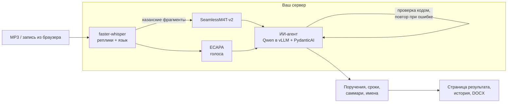

# Хаттама: ИИ-секретарь совещаний на вашем сервере

Примерно через минуту после короткого совещания Хаттама выдаёт протокол: какие поручения прозвучали, кто за них отвечает и к какому сроку. У каждого поручения есть ссылка на фразу, из которой оно взято. Хаттама понимает русский, казахский и смешанную речь и работает целиком на сервере заказчика: запись и текст не уходят ни в один внешний API.

Кейс HackAlem, трек 8 «Инновации». «Хаттама» по-казахски значит «протокол».

## Зачем это нужно

После совещания секретарь час переслушивает запись, чтобы выписать поручения. Часть задач теряется, «на следующей неделе» никто не превращает в дату, и через месяц трудно вспомнить, кто что обещал. В Казахстане совещания часто идут на двух языках вперемешку, а запись совещания холдинга, банка или госоргана нельзя отдавать облачному сервису. Хаттама сделана для секретариатов и аппаратов руководителей именно в таких организациях.

## Что умеет сейчас

- Распознаёт русский, казахский и смешанную речь. Казахские фрагменты перераспознаёт отдельная модель SeamlessM4T: на тестовой казахской записи ошибка 11% (у одного Whisper около 45% в предварительном замере без журнала).
- Разделяет голоса и называет людей по тому, как к ним обращаются на совещании. Если признака нет, имя не выдумывается.
- Извлекает поручения с помощью ИИ-агента на локальной языковой модели. Агент может перечитать нужные реплики, а код проверяет каждый его ответ и возвращает на исправление, если ссылка ведёт в несуществующую реплику или имя ответственного человека не совпадает со списком участников.
- Переводит «до пятницы» в дату и показывает статусы «в работе», «скоро срок», «просрочено».
- Записывает встречу прямо из браузера: микрофон и звук вкладки Teams, Zoom или Meet, после подтверждения, что участников предупредили (Chrome или Edge, режим GPU, проверено вручную).
- Сохраняет протоколы в историю и выгружает DOCX. [Пример протокола](docs/examples/meeting-2.docx).

## Всё остаётся у вас

Распознавание, разделение голосов и языковая модель работают в ваших контейнерах на одном GPU-сервере. Сервис сам отклоняет адрес языковой модели за пределами частной сети. Аудио удаляется сразу после обработки, голосовые отпечатки не сохраняются, в интерфейсе нет внешних CDN. От чистого сервера до первого протокола уходит около 20 минут ([журнал](docs/runs/1645-fresh-machine-cold-readme.log)).

## Результаты

Все цифры получены реальным прогоном моделей на RTX PRO 6000. Ошибку распознавания и поручения на тестовых записях можно пересчитать без GPU; сверка с эталонами организаторов сделана вручную по выводу `scripts/compare_reference.py`.

| Проверка | Результат |
|---|---|
| Совещания №1 и №2 организаторов против эталонных протоколов | вручную сверены 10 из 10 и 6 из 6 строк эталона: ответственный и срок совпадают, лишних поручений нет ([журнал](docs/runs/1708-reference-match.log)) |
| Казахская запись | ошибка распознавания 11%, поручения 3 из 3 |
| Смешанная русско-казахская речь | поручения 3 из 4, лишних нет; ошибка распознавания 36%, это главное направление доработки |
| Кто говорит | 5 голосов на каждом совещании, по имени названы 4 из 5 и 5 из 5 |
| Скорость | совещание длиной от 3,5 до 4,5 минуты обрабатывается за 32-65 секунд ([замеры](docs/ENVIRONMENT.md)) |
| Чистый сервер строго по README | полная проверка с реальными моделями прошла ([холодный старт](docs/runs/1645-fresh-machine-cold-readme.log), [check.sh all](docs/runs/1713-eldest-check-all.log)) |

## Куда это растёт: ИИ-агент аппарата руководителя

**Это план: в текущем прототипе агентного слоя нет.**

Хаттама сейчас proof of concept. Самое ценное в ней уже работает на своём сервере: цепочка «речь, понимание, проверяемые действия», в которой языковая модель действует как агент. На той же инфраструктуре и без внешних API её можно превратить в агента, который ведёт исполнительскую дисциплину целиком.

Следующий шаг: открытый агентный фреймворк [Hermes Agent](https://github.com/NousResearch/hermes-agent) (Nous Research), подключённый к той же локальной модели в vLLM. Хаттама останется источником фактов, а агент получит инструменты и будет действовать.

1. **Контроль сроков.** Каждое утро агент будет находить поручения со статусом «скоро срок» и «просрочено» и писать ответственному во внутреннюю почту или мессенджер, с цитатой из совещания. Руководитель будет получать сводку просрочек по подразделениям.
2. **Ответ исполнителя.** Сотрудник сможет ответить агенту «сделано», «нужен ещё день» или «это не моё». Агент обновит статус, зафиксирует перенос и передаст спорное секретарю.
3. **Память организации.** Вопрос «что решили по Павлодарскому заводу за квартал?» получит ответ со ссылками на реплики из всех протоколов.
4. **Подготовка совещания.** Агент соберёт повестку из незакрытых поручений и напомнит докладчикам.
5. **СЭД.** Протокол и поручения будут регистрироваться в системе документооборота как документ и резолюции.
6. **Процессы компании.** Шаблоны протоколов, регламенты и правила эскалации оформляются как навыки агента, ядро переписывать не придётся.

Каждое действие агента можно будет проверить по ссылке на исходную реплику и журналу действий. Остальные шаги (точность смешанной речи, лицензия, длинные совещания) описаны [в конце](#точность-и-масштаб).

## Как устроено



## Соответствие кейсу

| Требование кейса | Что сделано | Статус |
|---|---|---|
| Распознавание RU, KZ, смешанной речи | faster-whisper large-v3, казахские фрагменты через SeamlessM4T-v2 | есть; смешанную речь улучшаем |
| Кто говорит | ECAPA и имя по обращениям в речи | есть |
| Поручения: кто, что, срок | ИИ-агент на локальной Qwen, ссылки на реплики, даты сроков | есть |
| Саммари и протокол | страница результата, история, DOCX | есть |
| Уведомление о записи | подтверждение секретаря перед записью | есть |
| Контроль сроков | статусы «скоро срок» и «просрочено» | есть; рассылки напоминаний нет, она запланирована в агентном слое |
| Источник звука | файл, запись микрофона и вкладки Teams/Zoom/Meet из браузера | есть; бот-участник в планах |
| Закрытый контур | всё в своих контейнерах, без внешних API при обработке | есть; работа без интернета после установки не проверялась |

## Запуск: полный конвейер на GPU (основной путь)

Так Хаттама работает у заказчика: все модели запускаются на одном GPU-сервере через Docker Compose. Проверенная машина: NVIDIA Brev, инстанс AWS `g7e.2xlarge` с RTX PRO 6000 Blackwell 96 ГБ. Как получить такую же и во что обходится запуск, описано в [docs/ENVIRONMENT.md](docs/ENVIRONMENT.md).

1. В консоли NVIDIA Brev создайте GPU-инстанс `g7e.2xlarge` (RTX PRO 6000 Blackwell, Ubuntu 22.04 с Docker и NVIDIA Container Toolkit), затем `brev refresh` и `ssh <имя-инстанса>`.
2. Клонируйте репозиторий и выполните команды ниже из его корня. На чистой машине первый запуск со скачиванием образов и моделей занимает около 20 минут ([журнал](docs/runs/1645-fresh-machine-cold-readme.log)).

Нужны Linux x86_64, Docker Engine с Compose v2 и NVIDIA Container Toolkit. Для проверяемой конфигурации используется NVIDIA RTX PRO 6000 Blackwell Server **96 ГБ VRAM**, драйвер 595.91.07, примерно 64 ГБ RAM. Минимальные ресурсы для других GPU не измерены. Предусмотрите около 100 ГБ свободного диска на образы, модели и кэши; точный минимум не измерен. Первое скачивание моделей требует интернета, но не аккаунтов; аудио/текст при скачивании не передаются.

В конфигурации фиксированы CUDA-библиотеки для ASR, torch 2.8.0+cu128, точные ревизии моделей и digest образа vLLM. GPU-конвейер не откатывается на воспроизведение при ошибке.

Из корня репозитория:

```bash
mkdir -p outputs
docker compose build app
docker compose up -d --wait --wait-timeout 1800 llm
docker compose run --rm app -m meeting_protocol "docs/Трек 8 Инновации/Совещание №1.mp3" --mode gpu --date 2026-09-23 --output outputs/meeting-1
docker compose run --rm app -m meeting_protocol "docs/Трек 8 Инновации/Совещание №2.mp3" --mode gpu --date 2026-09-23 --output outputs/meeting-2
```

Та же страница с реальными моделями:

```bash
docker compose up -d app
```

Адрес — [http://127.0.0.1:8001](http://127.0.0.1:8001). Сервис LLM доступен только во внутренней сети Compose. Приложение привязано к localhost; для удалённой машины используйте SSH-туннель. Публичный сервис с авторизацией не реализован.

Остановка:

```bash
docker compose down
```

Проверка GPU из свежего клона выполняет приведённые выше команды, проверяет DOCX/JSON и завершает созданные проверкой контейнеры:

```bash
bash scripts/check.sh gpu
```

Оба режима за один запуск (нужны uv и свободная GPU):

```bash
bash scripts/check.sh all
```

Свои записи, список участников и тема, кэши моделей и dev-стек команды: [docs/TECHNICAL.md](docs/TECHNICAL.md#свои-записи-и-кэши) и [docs/ENVIRONMENT.md](docs/ENVIRONMENT.md).

### Нет GPU: быстрая проверка

Если GPU нет, работоспособность проверяется за 5 минут на любом компьютере. Это воспроизведение сохранённых реальных результатов двух комплектных MP3, модели не запускаются. Нужны Git и [uv 0.12.18](https://docs.astral.sh/uv/getting-started/installation/):

```bash
uv sync --locked
uv run --locked python -m meeting_protocol "docs/Трек 8 Инновации/Совещание №1.mp3" --output outputs/meeting-1
uv run --locked python -m meeting_protocol "docs/Трек 8 Инновации/Совещание №2.mp3" --output outputs/meeting-2
bash scripts/check.sh replay
```

Метрики пересчитываются командами `uv run --locked python scripts/evaluate.py data/eval/kz_01.json data/eval/mix_01.json` и `uv run --locked python scripts/compare_reference.py`. Веб-страница и подробности режима: [раздел в конце](#запуск-без-gpu-и-docker-воспроизведение).

## Как это устроено подробнее

- Гибридное распознавание русского и казахского, условия замера ошибки: [docs/TECHNICAL.md](docs/TECHNICAL.md#казахский-и-смешанный-язык-m3-m4-и-измеренное-качество).
- Разделение голосов и выбор порога: [docs/TECHNICAL.md](docs/TECHNICAL.md#различение-говорящих-m6).
- Запись в браузере и хранение протоколов: [docs/TECHNICAL.md](docs/TECHNICAL.md#запись-встречи-в-браузере-r5-r3).
- Модули кода и проверки совместимости моделей: [docs/TECHNICAL.md](docs/TECHNICAL.md#архитектура-и-проверка-моделей).
- Все журналы проверок с пояснениями: [docs/TECHNICAL.md](docs/TECHNICAL.md#проверки-и-журналы).

## Данные и сторонние компоненты

- `docs/Трек 8 Инновации/`: ТЗ, два MP3 и два эталонных DOCX из комплекта организаторов. Из эталонов в `data/meeting-context.json` перенесены только тема и имена для открытого контекста агента. Поручения и сроки из эталонов не используются как ответы моделей. Перед публичной демонстрацией реальных персональных данных требуется анонимизация; происхождение имён в комплектных записях отдельно не подтверждено.
- `data/test/kz_01.m4a` и `mix_01.m4a`: собственные записи участника команды, вымышленные имена. `*.reference.md` — сценарии и ожидаемые поручения; сценарии на слух ещё не сверены и пока не являются эталоном WER. В обеих записях один голос, проверка диаризации по ним не проводится.
- `data/replay/`: JSON, полученные реальными ASR и LLM на комплектных MP3, с хешем входа и сведениями о запуске. При изменении конвейера обновляются только новым реальным прогоном.
- [faster-whisper](https://github.com/SYSTRAN/faster-whisper), CTranslate2 и [Whisper large-v3](https://huggingface.co/Systran/faster-whisper-large-v3): MIT; ревизия весов `edaa852ec7e145841d8ffdb056a99866b5f0a478`.
- [SeamlessM4T-v2-large](https://huggingface.co/facebook/seamless-m4t-v2-large): **CC-BY-NC-4.0**, ревизия `5f8cc790b19fc3f67a61c105133b20b34e3dcb76`; коммерческое применение требует отдельного решения по лицензии.
- [Qwen3.8-27B-NVFP4](https://huggingface.co/nvidia/Qwen3.8-27B-NVFP4): Apache-2.0, ревизия `482ca0f3832238542f8f5295dde86b5f22711d80`; vLLM 0.30.0, digest закреплён в Compose.
- PydanticAI, Pydantic, FastAPI, python-docx, PyAV, Transformers, PyTorch, NVIDIA CUDA-библиотеки и uv используются как сторонние зависимости; точные версии находятся в `pyproject.toml` и `uv.lock`. [SpeechBrain](https://github.com/speechbrain/speechbrain) 1.0.3 (Apache-2.0) и модель [spkrec-ecapa-voxceleb](https://huggingface.co/speechbrain/spkrec-ecapa-voxceleb) (Apache-2.0, ревизия `0f99f2d0ebe89ac095bcc5903c4dd8f72b367286`) — диаризация; torchaudio 2.8.0 — её зависимость. WER считается собственной функцией в `scripts/evaluate.py` (jiwer не используется).
- Docker-образы: `python:3.11.13-slim-bookworm`, `ghcr.io/astral-sh/uv:0.12.18`, `vllm/vllm-openai` (все по закреплённому digest в `Dockerfile` и `compose.yaml`).
- Разработка велась с ИИ-агентами Claude Code и Codex, с навыками агентов [mattpocock/skills](https://github.com/mattpocock/skills) (закреплены в `skills-lock.json`) и [Leonxlnx/taste-skill](https://github.com/Leonxlnx/taste-skill) (дизайн интерфейса). Внешние модели не участвуют в обработке записей. Единственные сервисы полного запуска — собственные контейнеры на сервере заказчика; первоначальная установка скачивает пакеты и веса из публичных реестров.

## Ограничения

- Поручения и саммари — черновик ИИ, их проверяет секретарь. Разбиение задач может отличаться от эталонных таблиц.
- **ASR искажает имена и названия**: «Батагус» вместо «Ботагоз», «Анастас» вместо «Жандос»; в первом примере искажено название области в поручении по модернизации завода. Агент нормализует по списку участников только ответственных в поручениях, транскрипт не переписывается. Таблица эталона не подставляется для скрытого исправления.
- При неполном списке участников неустановленный личный исполнитель остаётся неуказанным.
- Ведущий в обоих примерах остаётся без имени: к нему не обращаются по имени. Реплика, в которой звучат два голоса, приписывается одному. DER не измерялся.
- Сроки переводятся в даты от даты встречи; срок, зависящий от события («по итогам совещания»), остаётся без даты.
- Статус R4 («просрочено», «скоро срок» — не больше 3 дней, «в работе») считается на текущую дату при показе страницы и выгрузке DOCX. Автоматических напоминаний и рассылок нет.
- WER и совпадение поручений измерены на двух коротких собственных записях одного диктора; совещания №1/№2 сверены вручную.
- Нет нативного подключения к Teams/Zoom/Meet, отдельной загрузки видео и live-протоколирования. PDF нет, только DOCX.
- Веб-сервис рассчитан на localhost в закрытом контуре: нет входа, защиты от CSRF и проверки заголовка `Host` (DNS rebinding), поэтому порт нельзя публиковать наружу. Лимит 100 МБ проверяется после приёма файла, тип файла заранее не проверяется.
- Публичного адреса нет; демонстрация локально или через SSH-туннель.
- README проверен на uv 0.12.18; более старые версии uv не гарантируются.
- Стенограмма передаётся агенту целиком. По оценке (около 900–1300 токенов на минуту речи при контексте модели 32 тыс. токенов) совещания длиннее 20–30 минут могут не поместиться; не проверялось. Решение — обработка стенограммы частями (дорожная карта).
- Модели скачиваются из публичных реестров при первой установке; запуск на сервере без доступа в интернет (`HF_HUB_OFFLINE`) не проверялся. Аудио и текст наружу не передаются в любом случае.
- Проверенная конфигурация — RTX PRO 6000 Blackwell 96 ГБ; модель Qwen в формате NVFP4 рассчитана на Blackwell, работа на других GPU не проверялась.

## Что в подходе нестандартного

- Казахский распознаётся гибридно: Whisper определяет язык каждого 20-секундного окна, казахские окна перераспознаёт SeamlessM4T-v2. Для смешанной речи Seamless сознательно не используется: там он переводит и теряет текст.
- Каждое поручение и каждое имя говорящего ссылается на номера реплик. Ответ агента проверяется кодом: несуществующая реплика, имя не из списка или одно имя на два голоса отправляют ответ на повтор.
- Голос получает имя только по явному признаку в речи (обращение и ответ, представление). Голосовые отпечатки не сохраняются; без признака голос остаётся без имени.
- Число голосов ограничено списком участников, мелкие отколовшиеся группы присоединяются к ближайшему голосу.
- Закрытый контур проверяется в коде: адрес LLM вне частной сети отклоняется, аудио не хранится.
- Результаты реального GPU-прогона сохранены и проверяются без GPU (`data/eval/`, `data/replay/`, связь с аудио по SHA-256).

## Точность и масштаб

Эти шаги снимают измеренные ограничения прототипа.

1. **Смешанная речь (ошибка 36%).** Язык сейчас определяется фрагментами по 20 секунд, а в шала-казахском язык меняется внутри фразы. Эксперимент: язык по каждой реплике и сравнение с Omnilingual ASR от Meta (Apache-2.0, есть казахский) на 10+ сверенных записях разных дикторов. Успех: ошибка на смешанной речи ≤ 25% без ухудшения казахского.
2. **Лицензия.** SeamlessM4T — некоммерческая лицензия CC-BY-NC-4.0; та же проверка Omnilingual ASR через `scripts/evaluate.py` покажет замену для коммерческого внедрения.
3. **Каждый голос с именем.** Ручное переименование голоса на странице результата; дальше — собственная видеосвязь (self-hosted Jitsi Meet) с отдельной дорожкой на участника: говорящий известен по дорожке, а не угадывается по голосу, и связь тоже остаётся внутри компании.
4. **Длинные совещания и нагрузка.** Разбиение стенограммы на части для совещаний на час и больше, очередь обработки, вход по ролям, протокол на казахском языке и шаблоны протоколов организации.
5. **Измеримость.** Ручная разметка комплектных совещаний для метрики разделения голосов (DER) и ошибки распознавания русского.

## Запуск без GPU и Docker: воспроизведение

**Это воспроизведение заранее вычисленных результатов, не проверка моделей.** Новая запись в этом режиме не распознаётся. Поддерживаются только два MP3 из комплекта организаторов; переименование файла допустимо, изменение содержимого — нет.

Нужны Git, интернет для первоначальной установки зависимостей и **uv 0.12.18** ([установка uv](https://docs.astral.sh/uv/getting-started/installation/)). Python **3.11.13** устанавливается uv автоматически; все зависимости закреплены в `uv.lock`. Личные аккаунты и платные подписки не нужны.

Из корня клонированного репозитория (bash, zsh или PowerShell; в Windows cmd.exe не проверялось):

```bash
uv sync --locked
uv run --locked python -m meeting_protocol "docs/Трек 8 Инновации/Совещание №1.mp3" --output outputs/meeting-1
uv run --locked python -m meeting_protocol "docs/Трек 8 Инновации/Совещание №2.mp3" --output outputs/meeting-2
```

В `outputs/` появятся JSON и DOCX для каждой записи. В документе есть исходный транскрипт, таблица поручений, саммари, сведения о происхождении и пометка о воспроизведении. Дата демонстрационных встреч принята за **23.09.2026**, это заданная база примера, не установленная из аудио дата.

Минимальный веб-интерфейс:

```bash
uv run --locked python -m uvicorn meeting_protocol.web:app --host 127.0.0.1 --port 8001
```

Откройте [http://127.0.0.1:8001](http://127.0.0.1:8001), загрузите один из комплектных MP3 и оставьте дату 23.09.2026. Откроется страница результата с кнопкой «Скачать DOCX»; протокол также появится на странице «История». Для неизвестного аудио отображается ошибка, вместо него не подставляется пример.

На форме есть **«Участники»** (по одному имени на строку) и **«Тема»**. Для двух MP3 поля заполняются по SHA-256 записи из `data/meeting-context.json`: только имена и темы из эталонных протоколов, без готовых поручений и сроков. В CLI эти же данные подставляются по хешу, если параметры не заданы. В списке второго примера также указан упомянутый юрист Ерлан; фамилий, которых нет в источнике, мы не добавляем. В режиме воспроизведения изменение темы, участников или даты отклоняется: для перерасчёта нужен GPU.

Проверка из свежего клона, включая оба документа и тесты:

```bash
bash scripts/check.sh replay
```

`check.sh` требует bash (в Windows — Git Bash). Ожидаемый итог: `PASS replay: не проверка моделей`; два теста диаризации в этом режиме пропускаются (`skipped`), потому что GPU-зависимости не установлены.
